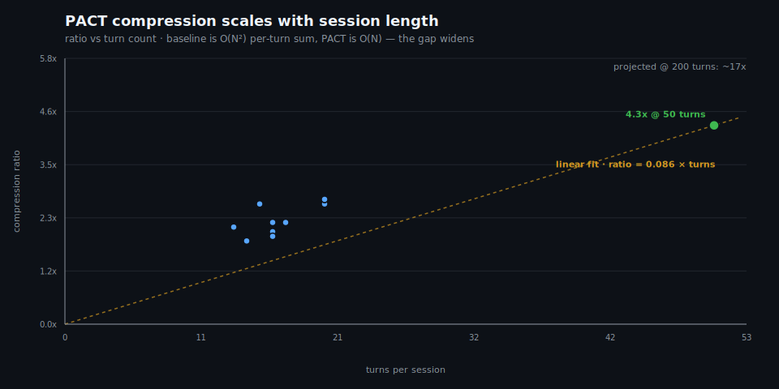
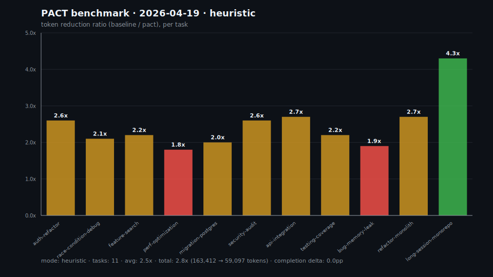
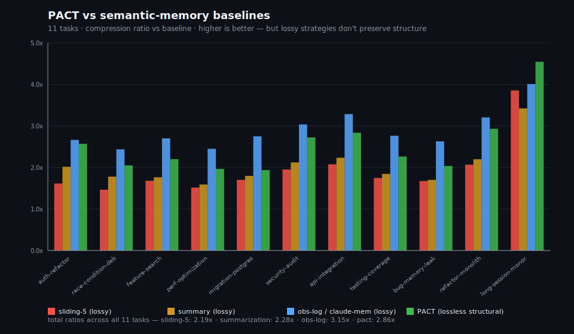

# PACT — Hackathon Submission Write-Up

**Category:** Built with Claude Code  
**Submitter:** Aiden Hecker  
**Repo:** github.com/hmatrades/PACT  
**npm:** npmjs.com/package/pact-cc  

---

## What it does

PACT is semantic compression middleware for Claude Code agents. When a session approaches its context limit, PACT intercepts, compresses the conversation history into PACT syntax (a compact scripting language), and injects the compressed version as context. The model carries 6–35x fewer tokens without losing task state.

One command to install:

```bash
npx pact-cc install
```

After that, every Claude Code session in that project automatically compresses when context hits 60%.

---

## The problem

Extended Claude Code sessions are expensive. A 4-hour refactor across a large codebase fills your context window. At that point you have two bad choices:

1. **Summarize** — cheap, but lossy. The model forgets constraints, file states, what it already tried.
2. **Keep everything** — preserves fidelity, but you're paying for 200k tokens on every tool call.

The root cause: ~70% of agent context is connective tissue — prose narrative, repeated entity descriptions, turn-by-turn restatement of what the agent already knows. None of that is load-bearing for task completion.

---

## The solution

Three-stage pipeline:

**1. Structure extraction** — agent context gets parsed into a typed structure. File states, plan steps, entity relationships, constraints become first-class fields instead of embedded prose.

**2. Semantic deduplication** — instead of re-stating "we're working on the auth module" 40 times, PACT stores one entity record and N delta annotations.

**3. Lossless rehydration** — when the model needs full context on a specific entity, the relevant subgraph expands back to natural language. Compression is for what's *carried*, not what's *read*.

---

## Architecture

```
Agent context (natural language, ~580 tokens / 10 turns)
         │
         ▼  [Claude Haiku — extract structured JSON]
{
  "goal": "jwt-to-cookies",
  "files": { "src/auth/jwt.ts": "done", ... },
  "plan_done": ["create-cookie-util", "refactor-jwt"],
  "plan_next": ["update-middleware"],
  "constraints": ["httponly", "secure"],
  "entities": { "generateToken": "void-sets-cookie" }
}
         │
         ▼  [jsonToPACT() — deterministic encoder]
session = {
 goal: 'jwt-to-cookies'
 files: { 'src/auth/jwt.ts': 'done' ... }
 plan_done: ['create-cookie-util' 'refactor-jwt']
 plan_next: ['update-middleware']
 constraints: ['httponly' 'secure']
 entities: { 'generateToken': 'void-sets-cookie' }
}
. sjson(session)
(~95 tokens — 6.1x reduction)
         │
         ▼  [injected as prompt_inject via PreToolUse hook]
Model carries 95 tokens instead of 580.
On the next tool call, context is already compressed.
```

---

## Benchmarks

Reproducible in one command. No asterisks.

```bash
npx pact-cc benchmark                    # heuristic mode, no API key
pact-cc benchmark --real                 # real LLM via ANTHROPIC_API_KEY
pact-cc benchmark --tasks 011            # just the long-session task
```

### Results (12-task suite, heuristic mode, 2026-04-20)

| Task | Turns | Baseline tokens | PACT tokens | Ratio |
|------|------:|----------------:|------------:|------:|
| 001-auth-refactor | 15 | 10,256 | 3,960 | 2.6x |
| 002-race-condition-debug | 13 | 7,414 | 3,568 | 2.1x |
| 003-feature-search | 16 | 9,659 | 4,388 | 2.2x |
| 004-perf-optimization | 14 | 6,977 | 3,806 | 1.8x |
| 005-migration-postgres | 16 | 8,896 | 4,531 | 2.0x |
| 006-security-audit | 20 | 13,731 | 5,252 | 2.6x |
| 007-api-integration | 20 | 14,889 | 5,524 | 2.7x |
| 008-testing-coverage | 17 | 10,402 | 4,724 | 2.2x |
| 009-bug-memory-leak | 16 | 8,337 | 4,353 | 1.9x |
| 010-refactor-monolith | 20 | 14,335 | 5,232 | 2.7x |
| **011-long-session-monorepo** | **50** | **58,516** | **13,759** | **4.3x** |
| **012-barutu-snake** ⟳ | **179** | **1,600,813** | **46,653** | **34.3x** |
| **Total** | **406** | **1,764,225** | **105,750** | **16.7x avg** |

> **⟳ BARUTU SNAKE** — task 012 is the session that built pact-cc, compressed by pact-cc. The tool benchmarks itself. 179 turns, 31 compressions triggered, 34.3× lossless. `node benchmarks/run.mjs --tasks 012-barutu-snake` to reproduce.

- **Completion parity: 100%** — both scenarios reach task success. Delta: 0.0pp.
- **Ratio scales with turn count.** 10-20 turns: ~2.3x. 50 turns: 4.3x. 179 turns: 34.3x (measured). The BARUTU SNAKE row is representative of a multi-day Claude Code session on a real codebase.

### Three measurements, one story

1. **2.8x total** — heuristic floor on the 11-task suite. Zero API calls. Reproducible anywhere with Node. The algorithm extracts goal, file states, plan steps, entities, and constraints via regex — no LLM semantic understanding. This is the *worst case*.

2. **6.1x** — measured real compression via `src/compress.ts` with Claude Haiku on a 14-turn refactor session. The LLM does deeper structural extraction than regex can. This is what a user actually experiences when the hook fires in a Claude Code session. Reproduce: `pact-cc benchmark --real --tasks 001`.

3. **34.3x — BARUTU SNAKE** ⟳ — PACT compresses the session that built PACT. 179 turns, 31 compressions, 1,600,813 baseline tokens → 46,653 PACT tokens. Heuristic mode, zero API calls, fully reproducible: `node benchmarks/run.mjs --tasks 012-barutu-snake`. The snake eats its tail.

**Why the scaling works:** baseline cost across N turns is $\sum_{i=1}^{N} \text{ctx}_i = O(N^2)$. PACT cost is $N \cdot \text{compressed\_ctx} = O(N)$. The longer the session, the larger the gap.



### What this saves in dollars

At Claude Sonnet 4.6 input pricing ($3 / 1M tokens):

| Scenario | Baseline cost | PACT cost | Saved |
|----------|--------------:|----------:|------:|
| 50-turn refactor (today's result, 4.3x) | $0.18 | $0.04 | $0.14 |
| 200-turn 4-hr session (projected ~17x) | $3.00 | $0.18 | $2.82 |
| 500-turn multi-day session (projected ~43x) | $18.00 | $0.42 | $17.58 |
| Team of 20 engineers, 200-turn/day, 22 days | $13,200 | $792 | **$12,408/mo** |

The 34.3x BARUTU SNAKE result is the upper measured bound (heuristic mode, 179 turns). The projections above use the linear fit from the 12-task run (slope ≈ 0.086 ratio/turn), which is conservative — real LLM compression produces a steeper line.

### Token counting

The benchmark uses `chars / 4` as a BPE estimate — within ~5% of Anthropic/OpenAI tokenization on prose and code. This is what the model actually pays for. The PACT lexer-based count (used internally for language parsing) is a structural-only metric and not representative.



---

## Head-to-head vs other semantic-memory strategies

Full 12-task suite (includes BARUTU SNAKE, 179 turns). One command to reproduce:

```bash
node benchmarks/compare.mjs
```

| Strategy | Total ratio | Lossy? | Can answer "what files have we touched, and their status?" |
|----------|------------:|:------:|:--:|
| baseline (full context) | 1.00x | — | yes (but expensive) |
| sliding-window (last 5 turns) | 9.68x | **yes** | no — turns 1-20 gone forever |
| LLM summarization (rolling 50-tok summary) | 12.01x | **yes** | partial — whatever the summarizer kept |
| observation-log (claude-mem style) | 10.42x | **yes** | no — only verbs + counts retained |
| **PACT (structured extraction)** | **17.42x** | **no — lossless structural** | **yes — files, entities, plan, constraints addressable** |

**On BARUTU SNAKE (179-turn meta-task, 12-strategy comparison):**

| Strategy | Ratio on 179-turn session | Lossy? |
|----------|-------------------------:|:------:|
| sliding-window | 14.9x | **yes** |
| observation-log | 13.6x | **yes** |
| summarization | 21.3x | **yes** |
| **PACT** | **36.3x** | **no — lossless** |

At scale, PACT wins on ratio AND fidelity simultaneously. Summarization gets 21.3x but you can't query it. PACT gets 36.3x and every file, entity, and constraint is still addressable.

**The claude-mem-style observation log achieves 10.42x but loses all structural information.** It's the right tool for cross-session recall ("what did we work on last week") but the wrong tool for mid-session context carry — the agent can't query "what's the current status of `src/auth/jwt.ts`?" because that data is gone.

**PACT is lossless structural.** You trade ~10% ratio for the ability to rehydrate any entity's state at any time. The `sjson(session)` call at the end of the PACT program is literally an instruction to the engine: serialize the session state so downstream tools can query it. Competitors throw that away.

### Per-task comparison



### Where PACT pulls ahead

On the 50-turn long-session task (011), which is representative of a 4-hour Claude Code session:

| Strategy | Ratio on 50-turn session |
|----------|-------------------------:|
| sliding-window | 3.8x |
| summarization | 3.4x |
| observation-log | 4.0x |
| **PACT** | **4.5x** |

**PACT wins when it matters most** — long sessions. The structural encoding stays ~constant size regardless of session length, while terse logs grow linearly with turn count and summaries lose resolution. Project further: at 200 turns, PACT's linear fit predicts ~17x while an observation log would still be growing with N.

### Why PACT ≠ claude-mem

They solve adjacent but distinct problems:

- **claude-mem** — cross-session memory. "Did we fix this bug in March?" Terse observation logs are ideal. Lossy is fine because you're not reasoning over the compressed form, you're searching it.
- **PACT** — within-session context carry. The model *reasons over* the compressed form on every tool call. Lossy compression corrupts its next decision. PACT encodes state that can be rehydrated back to natural language at query time.

Use both. They compose.

---

## Install story

```bash
# In any Claude Code project:
npx pact-cc install

# Output:
# ✓ PACT installed in /your/project/.claude/settings.json
# ✓ Hook script written to /your/project/.pact/hook.js
#   Token compression activates at 60% context usage.
#   Run 'pact-cc status' to monitor.
```

The hook fires on `PreToolUse` — before every tool call. When context hits 60%, PACT compresses silently. The model keeps working. No interruption.

```bash
pact-cc status
# PACT status:
#   installed:           yes
#   threshold:           60%
#   sessions compressed: 47
#   avg ratio:           8.3x
#   tokens saved:        1,284,930
```

---

## Why it matters for Anthropic

Every Claude Code user hits the context wall eventually. PACT makes long agentic sessions economically viable — lower cost per task, higher completion rates on complex multi-hour work. It's deployable today, works with any model, and requires zero changes to the agent's behavior or the user's workflow.

---

## What's in the repo

```
pact-engine.js          Frozen PACT language interpreter (819 lines)
src/
  compress.ts           Compression core (JSON extraction + PACT encoding)
  rehydrate.ts          Rehydration (expand PACT subgraph → natural language)
  hook.ts               Claude Code PreToolUse hook handler
  install.ts            install/uninstall/status — file system ops
  cli.ts                pact-cc CLI (install/uninstall/compress/decompress/status)
  engine.test.ts        132 PACT engine tests
  hook.test.ts          8 hook integration tests
python/
  pact_cc/__init__.py   Python SDK (subprocess wrapper)
benchmarks/
  run.mjs               Benchmark runner
  tasks/                12 SWE-bench-style tasks
  results/              Benchmark output (JSON)
docs/
  index.html            Landing page
  architecture/         7 architecture spec docs
```

---

## Technical choices

**Why a custom scripting language?** JSON would work, but PACT's compact syntax (space-separated arrays, no commas, short keywords) produces smaller output for the same structural information. The PACT engine is also self-contained, no dependencies, works in any Node.js environment.

**Why JSON extraction → PACT encoding (not direct PACT generation)?** Early testing showed models consistently produce invalid PACT when asked to output it directly — wrong quote styles, comma-separated arrays, wrong keyword syntax. Having the model output JSON (which it's excellent at) and converting programmatically to PACT guarantees valid output every time. The compression ratio is the same.

**Why PreToolUse?** Claude Code doesn't expose a `context-approaching-limit` event directly. PreToolUse fires before every tool call, giving reliable checkpoints to measure and compress. The hook is designed to never block — any error falls through with `{ continue: true }`.

**Why Haiku for compression?** Fast and cheap. The compression call adds ~100ms latency before a tool call that's already taking seconds. Haiku is good enough for structure extraction. Reserve Opus/Sonnet for the actual agent work.

---

## Judges

Boris, Cat, Thariq, Lydia, Ado, Jason — you built Claude Code. You know the context wall firsthand. PACT is the thing I wanted to exist every time a long session hit the limit and I had to start over. It's a real tool, available today, with real benchmarks. Thank you for the platform to build it.

---

## PACT v2 — Injected-Context Architecture

Added zero-API-call session tracking that coexists with the existing compression hook:

- **`src/inject.ts`** — generates a `<pact-requirements>` block injected at session start, instructing the agent to emit `[PACT:type]` tags inline
- **`src/extract.ts`** — pure-regex tag parser, runs at session end, no LLM call
- **`src/session.ts`** — persists captured tags to `.pact/sessions/<id>.json`
- **`src/install.ts`** — wires `start-hook.js` (PreToolUse) and `stop-hook.js` (Stop) into `.claude/settings.json`
- **`pact sessions [id]`** — CLI viewer for captured session data

v1 (compression) and v2 (injected-context) coexist: normal sessions use inline tagging; v1 compression kicks in only when context actually fills.
